# Farm Quiz Game — Master Design Document

**Version:** 1.1 — Progression tree pass (2 Oct 2026). Version 1.0 (the Primer/Briefing merge) is kept in `archive/`.

> **What changed in 1.1**
> - **New §33 Production & Unlock Tree.** Five chapters, 154 unlockables, 132 items, 94 recipes, paced by a simulation to ≈25 hours with the five pets at ≈1 / 6 / 10 / 18 / 25 h. The data lives in `progression/farm-progression.json`; `progression/progression-explorer.html` browses and checks it.
> - **New §34 Engine & asset pipeline** (HTML5 vs Godot) and **§35 Review notes** (prototype bugs fixed in this pass, plus what still needs a decision).
> - **Proposed resolutions** for several open questions, each marked *Proposed (1.1)* where it applies and collected in §30: manure becomes a compost loop; bees need flowers, not wheat or sugar; sugar comes from beets only; Lumbermill gets the "Extra" slot; Barn tiers carry the big animals; the Watering track saves water; Import Broker arrives with the 4th pet; linen and dyed wool replace silk.
> - Corrected statements: layout status (§17.5), Bread's place in the sequence (§9.2), animal conversions that lose money (§8.1).

---

## How to read this document

Every claim below carries a status tag so you always know how real something is:

| Tag | Meaning |
|---|---|
| **Implemented** | Verified in the current five-file prototype snapshot, or explicitly tested successfully. |
| **Partially Implemented** | The underlying mechanic exists, but a requested UX or final form is still missing. |
| **Placeholder** | The UI/location exists to reserve the concept, but the system behind it isn't built. |
| **Conceptual / Planned** | Established design direction, actively referenced in project discussion, not yet built. |
| **Dormant** | Specified once in the original Primer (including its brainstorm tail) and not reaffirmed, contradicted, or built on since. Carried forward here at full strength rather than dropped — but it needs a fresh yes/no before it's scheduled, because it may simply have fallen out of the conversation rather than been deliberately deprioritized. |
| **Inferred** | A reasonable conclusion drawn from combined design decisions, not a direct specification. |

---

## 1. Vision

### 1.1 Premise and setting

A medieval, craft-from-scratch farming game. The protagonist returns to a devastated farm — nothing works but the Well, the plots are barren, and only a Tent, hands, and a handful of wheat seeds remain. The player rebuilds the farm from nothing.

### 1.2 Target player and educational purpose *(Inferred, high confidence)*

The Primer's brainstorm tail repeatedly frames the audience as **children** — bars exist "so that children can immediately and intuitively get an idea," a proposed mini-game exists explicitly to "train eye tracking and fine motor skills,".

Stated educational aims:
1. **Resource planning** — deciding where scarce resources go.
2. **Opportunity cost** — saving an item for a future recipe vs. selling now.
3. **Sustainability, especially water** — water is intentionally visible and central.
4. **Light arithmetic with two-digit numbers** — via the Training Quiz.
5. **Quick-recall practice** — short response windows, repeated exposure, eventually spaced repetition.

The learning mechanics are meant to be the game's economy, not a bolted-on quiz layer.

### 1.3 The player fantasy

The satisfaction is not "I harvested a crop." It's **"I turned a handful of scarce resources into something valuable, and that unlocked the next part of my farm."** The full intended chain:

> seed → crop → animal/processing input → intermediate ingredient → processed ingredient → recipe → finished dish → pet/progression key

with water, energy, time, tools, and coins as competing constraints throughout.

### 1.4 The hidden narrative goal

**Five secret vegetarian pets** are the game's true destination. They are not announced up front with a tracker or checklist — recipes, ingredients, appliances, tools, and marketplace content gradually reveal what's possible, and the player discovers the dishes that bring each pet home. The farm is being rebuilt *for someone to come home to*.

### 1.5 What this game deliberately is not

Stated explicitly in the Primer as a boundary, and worth keeping as one:

- No XP/level system.
- No timed locks beyond the 1-question animal cooldown and Aging Station waits.
- No multi-screen navigation; no tech-tree UI. Dependencies are shown only when relevant. *(The complete tree in §33 is a design tool for us; players never get it as a screen.)*
- No direct coin rewards from quizzes — questions advance time and trigger passive production, nothing else.

---

## 2. Core Design Principles

- **The farm stays on one screen.** Detailed actions open contextual modals; the underlying systems can deepen without adding navigation layers.
- **Minimal text, strong visual signals.** Icons, numbers, compact requirement bars, visible locks, short labels, cause/effect interactions — not paragraphs.
- **Water is strategic, not decorative.** Every extra crop or animal indirectly competes for the same Well-fed water pool. The lesson isn't "water exists," it's *every choice that uses water reduces what's available for another choice.*
- **Energy is for actions; Training is how you replenish it.** Time Quiz and Training Quiz are deliberately separate loops. Time Quiz never grants energy.
- **Sell now vs. save to pantry** is the foundational expression of opportunity cost, and it recurs after every harvest, conversion, and craft.
- **Dependencies are visible only when they matter** — at the moment something is being unlocked or built. Once unlocked, routine screens show only the *immediate* inputs for the next action.
- **Upgrades replace, they don't multiply.** Hands → Wooden Shovel → Iron Shovel → Steel Shovel: one active tool, not four managed forever. The Primer is specific that this is literal — **the prior tier is consumed as an input to the upgrade**, not simply swapped out in the UI. Production responsibilities also migrate to their logical station as the farm matures (e.g., flour: Kitchen → Workshop Mill).

---

## 3. The Core Loop

1. **Answer the Time Quiz.** A correct answer advances farm time by one question-step. This can simultaneously: grow crops, refresh animal cooldowns, produce Well water, and roll a chest chance (§16). It does **not** award energy.
2. **Inspect the changed farm.** Crops closer to harvest, more water, animals available again — the quiz answer should feel like a game action, not an interruption.
3. **Harvest.** Sell now for coins, or save to pantry. Costs energy.
4. **Convert** raw materials through animal areas and, later, processing stations. Costs water and energy; animal conversions are intentionally water-heavier than plant harvests, by design, to keep the sustainability lesson present.
5. **Craft** finished goods. Same sell-vs-save choice.
6. **Spend** coins and materials on seeds, animals, Well upgrades, buildings, tools, and Marketplace unlocks.
7. **Progress** toward the pet dishes. Recipes unlock once the player holds at least one ingredient matching the recipe template's required tag(s) *and* the required appliance/tool prerequisite is built. Once unlocked, a recipe template stays visible in the Recipe Book even if its ingredients are later depleted. Not-yet-unlockable recipes remain visible under a lock icon everywhere relevant, so the path stays legible without cluttering the screen.

---

## 4. The Two Quiz Systems

### 4.1 Time Quiz

The game's time engine. **Implemented** as a separate `farm-quiz-engine.html`, embedded as an iframe, communicating with the farm via `postMessage`.

Current behavior:
- Random question from a small bank; wrong answers show feedback without advancing time.
- Correct answer → farm's `questionsAnswered` increments by 1 → all planted crops gain one growth unit → Well adds water up to capacity → state saves.
- Supports Next Question and Close Quiz.

**Design constraint (permanent rule, both sources agree):** Time Quiz is a *time* mechanic. It must never become an energy faucet.

Future direction: a real, much larger question bank with difficulty progression, repetition rules, curriculum/topic tagging, and possibly multiple question types, tied more deliberately to the farm's actual systems.

**Review note (1.1):** two things undercut the time engine. (1) A wrong answer can simply be retried, so with two choices every question ends up advancing time; consider showing the right answer with its explanation and moving on without advancing time (wrong answers then come back sooner, which is the spaced-repetition idea). (2) The bank has 4 questions, while a full playthrough is ≈1,350 Time Quiz answers (§33). Generated questions built from the player's own farm ("You have 14 water and wheat needs 2. How many can you plant?") would scale and tie the quiz to the farm.

### 4.2 Training Quiz

The quick-recall mini-game that restores energy. **Implemented** in simplified form.

Current behavior:
- Generated arithmetic question (simple small-number addition — a placeholder for the intended two-digit target), three answer choices, 3-second response window.
- **Correct answer → +5 energy, capped at max.**
- **Wrong answer or timeout → 0 energy.** *(Decision: the Primer's original "+1 safety net" is explicitly not kept. There is no floor reward.)*
- Continue / Close flow.

**Spaced repetition (Conceptual — Dormant until reaffirmed):** the original design specifically calls for an Anki-style scheduler underneath both quizzes — correct answers recede into the future, incorrect ones recur soon, adapting to what each player actually knows. Not yet implemented; the current generator is a flat random draw.

**Intended UX direction (Pending):** remove the separate Training button; tapping the **Energy indicator itself** launches Training. Makes the resource its own entry point to replenishment and simplifies the top bar.

---

## 5. Resource Economy

### 5.1 Coins

Earned primarily by **selling outputs** — never directly from answering quizzes. Spent on seeds, animals, Well upgrades, buildings, tools, and Marketplace unlocks.

- **Target/final starting state (Primer, prioritized): 0 coins.** This is the intended poorest-start fantasy — the player earns their first coins by selling Porridge.
- **Current prototype value: 200 coins**, explicitly a testing convenience, not the intended economy.

### 5.2 Water

Finite capacity resource produced by the Well.

| Well level | Water/Time Quiz | Capacity |
|---|---:|---:|
| 1 | +2 | 20 |
| 2 | +4 | 30 |
| 3 | +6 | 40 |

Consumed by planting, animal conversion, and (later) processing/crafting. Well upgrades are intentionally **frequent and cheap**, coin-only early, to keep water salient without letting it overshadow coins. Animal conversions cost meaningfully more water than plant harvests — a deliberate economy-balance rule to keep the sustainability lesson visible.

*Proposed (1.1, §33):* Well 4 (+8 per question, holds 60; bricks + iron) and Well 5 hand pump (+11, holds 80; steel). Extra sources: Pond (+2, +20 storage), Rain Barrel (+1, +15), Tortoise pet (+1), Wind Pump (+4, +40). Tools cut use instead of adding water: Watering Can −25%, Drip Line −50% (§11).

### 5.3 Energy

Manual-action resource (planting, harvesting, converting, crafting, building).

- Living Quarters caps: Tent 20 → Cottage 30 → Farmhouse 50 (both sources agree).
- Current prototype: start 10, max 20; planting/harvesting cost 1; conversion/crafting costs vary by action; +5 on Training success; **0 on Training failure or timeout** (Decision, §4.2).
- Never granted by Time Quiz.

### 5.4 Seeds

Bought primarily through the **Seed Merchant**, always available for coins as a safety valve — the player is never permanently locked out of basic seeds.

- **Starting wheat seeds: 5** *(Decision — adopts the prototype's value over the Primer's original 10)*.
- **Pending UX:** seed quantity needs a visible requirement/progress bar in the planting interface, not text-only. Water and energy already have bars; seeds don't yet.

### 5.5 Manure *(Dormant — reinstated from Primer)*

The Primer states mid- and late-stage crops require manure to initiate growth. This resource has **no presence anywhere in the current prototype or its economy model** — not even as a placeholder. It needs to be reintroduced into the resource list and tied into the crop-growth-stage gating logic before mid/late crops can function as intended. Likely source: animal byproducts (needs a decision on which animal, or a dedicated collection mechanic).

*Proposed resolution (1.1):* manure feeds a **compost loop** instead of being a resource of its own. "Hungry" crops (tomato, sunflower, pumpkin, berries, all greenhouse crops) need 1 compost to be planted. Compost comes from the Compost Bin: 3 straw → 2 compost or 3 weeds → 2 compost (4 questions), and much faster with manure (1 manure + 1 straw → 3 compost in 3 questions) or oilcake from the press. Cows and sheep drop manure with every product. The goat pet adds a little compost by itself.

### 5.6 Requirement / progress bars

A repeatedly-validated UX pattern in both sources, and one of the strongest anchors in the whole design:

- A bar appears **directly below the number display** for *every* required input to an action — including coins.
- **Color coding:** red = low/empty, yellow = partial, green = sufficient/full.
- **Accessibility:** color must be paired with iconography, not carry meaning alone, for players with color vision differences. *(This accessibility note exists only in the Primer — the Briefing's version of this rule drops it entirely and should not.)*

Current status: water, energy, and Well-upgrade progress have bars. Seed quantity and conversion/cooldown timing do not yet (§22).

---

## 6. Farming System

### 6.1 Field layout

**12 central planting patches, 3×4 grid, zero gaps between them** — 9 ordinary field patches plus 3 reserved/special patches for later building or feature use. This supersedes the Primer's original 9-plot/3×3 concept; it's a deliberate later evolution (discovered through testing), not a contradiction to resolve.

### 6.2 Planting

Requires: 1 seed + crop-specific water + 1 energy. **Mid- and late-stage crops additionally require manure** (§5.5 — currently unimplemented). The planting modal shows crop icon, seed quantity, water requirement, energy requirement, and growth time in quiz questions. The whole field plot is already clickable (Implemented) — the remaining UX debt is applying that same whole-card interaction elsewhere (§22).

### 6.3 Growth and visuals

Two distinct mechanics work together here and are not in conflict, though they've only ever been described separately:

- **Growth stages** (per individual plant): sprout → developing crop icon → larger/pulsing "ready" stage. Currently implemented with emoji as a deliberate placeholder for future PNG art; crops should render centered in the patch, scaled rather than clipped.
- **Plants-per-plot** (Conceptual/Dormant): tool-tier upgrades (Digging, Watering) are meant to raise how many plants a single patch holds — 1 → 2 → 3+. Visual abundance for this is meant to come from simply **repeating the current growth-stage image in a small grid inside the patch** — no bespoke multi-plant art is needed. The current prototype only supports 1 plant per plot; this tiling behavior hasn't been built yet.

### 6.4 Canonical crop catalog

wheat, tomato, potato, onion, carrot, beet, lettuce, beans, olive, walnut, apple, berries, flax, **sunflower, pumpkin** *(sunflower and pumpkin added per Decision — previously mentioned only as example future Seed Merchant unlocks, now formally canonical)*.

Current prototype test set (Implemented, intentionally small): **wheat, carrot, tomato** only. Lettuce is explicitly confirmed canonical in the Primer and should not be second-guessed during content expansion.

*Proposed catalog (1.1, §33):* **field** — wheat, carrot, clover *(new: fodder and bee flowers)*, onion, potato, lettuce, beans, tomato, beet, oats *(new)*, sunflower, flax, pumpkin, berries, herbs *(new)*, woad *(new: blue dye)*; **orchard** (planted once, harvested again and again) — apple, walnut, olive; **greenhouse** — saffron crocus *(new)* and the heirlooms rainbow carrot and golden beet, which are the "rainbow vegetables" of §15.1. Wheat and oats also give straw.

### 6.5 The tomato unlock example

**2 eggs → unlock tomato seeds once → purchasable with coins thereafter.** Implemented and tested. This is a working prototype of an **ingredient-threshold unlock** — note this is mechanically distinct from the Marketplace's **dish-delivery unlocks** (§13); the two patterns should be named and tracked separately rather than treated as the same system.

---

## 7. Harvesting, Selling, and Pantry Decisions

Every production event ends in the same choice:

- **Harvest** → Sell now / Save to pantry / Cancel. Costs energy.
- **Animal products** → same pattern.
- **Crafted goods** (currently: Bread) → same pattern.

**Pantry** is the compact inventory UI, reached through the Storage/Barn slot, grouping raw crops, animal/bee products, and crafted goods. Selling from pantry is implemented.

**Pending:** make the **whole pantry item card** the click target for selling, not a small Sell button (§22).

---

## 8. Animal System

Four animal areas, all spatially implemented: Chicken, Cow, Sheep, Bee.

### 8.1 Chicken

**3 Wheat + 3 Water + 1 Energy → 1 Egg.** Trivial conversion by design — no processing chain intended for eggs. Each chicken converts once per question-step, then waits for the next Time Quiz. Chickens are purchasable; area has a capacity.

**Review note (1.1):** at the prototype's prices this conversion loses money (3 wheat sell for 9 coins, the egg for 6) and the cow only breaks even (4 wheat = 12 = 1 milk), so selling the wheat is always better. The tree (§33) uses: chickens 2 wheat + 1 water → 1 egg every question; cows 3 clover + 3 water → 1 milk + 1 manure every 2 questions (needs the Barn); sheep 2 clover + 2 water → 2 wool + 1 manure every 3 questions (needs the Sheep Pen and Shears); bees see §8.4. Every animal now earns more than its feed is worth, and animal products stay the thirstiest.

### 8.2 Cow

**4 Wheat + 4 Water + 2 Energy → 1 Milk** (current simplified conversion). Intended full chain:
- **Butter:** milk → Churn L1–3.
- **Yogurt:** milk + yogurt culture → Fermenter L1–3.
- **Cheese (fresh):** milk + cheese culture → Cheese Station (requires a built Pressing Machine).
- **Aged Cheese:** fresh cheese → Aging Station, N questions.

### 8.3 Sheep

**3 Wheat + 3 Water + 1 Energy → 1 Wool** (current simplified conversion). Intended chain: shearing → thread (Hand Spindle, stays in Sheep Area) → weaving, which **migrates to the Workshop** once the Textile Machine is built, consuming the Hand Loom in the process.

### 8.4 Bee

**2 Wheat + 2 Water + 1 Energy → 1 Honey** (current simplified conversion). Intended chain: Honey Extractor levels 1–3, later a Beeswax Extractor. Beeswax uses: candles (a night-craft prerequisite), waterproofing (a Cellar upgrade requirement), polish (Living Quarters upgrades), tool maintenance, and wax seals for special trades.

**Pollination / biodiversity system** *(Dormant — reinstated from Primer)*: bees don't need direct feeding via flowers. Planting pollinator-friendly crops grows the hive over each time cycle those crops are present; larger hives in turn benefit crop growth, though the exact mechanism (shorter grow time vs. lower water need) is explicitly **undetermined and needs playtesting** — this was an open question in the source, not a specification.

A more complex bee-economy variant is also proposed: harvesting honey requires *feeding the bees sugar* (since honey is being taken from them). Collection readiness is shown via a blinking indicator, at which point sugar is converted into honey + wax. The proposed sugar source is a **"Sugar Carrot"** — pressed into sugar water, aged/reduced at the Aging Station, then finished by an unspecified tool that turns syrup into a usable form. **Open inconsistency, flagged rather than resolved:** the Primer separately defines a *Beet → sugar/syrup* conversion (Press L1 + Stove L1 reduction) elsewhere in its recipe catalog. Whether "Sugar Carrot" is a distinct crop, a rare chest-only carrot variant (the same document elsewhere floats "purple carrots" as a luck-only cosmetic variant), or simply an inconsistent restatement of Beet, is an unresolved naming question that needs a designer decision before this system is built (see §31).

*Proposed resolution (1.1):* keep bees simple. They are never fed and never given sugar; a hive (straw skep first, wooden hive later) yields honeycomb every 2 questions as long as a flowering crop grows somewhere on the farm (clover, sunflower, flax, berries, herbs, fruit trees). Comb is crushed by hand (2 comb → 1 honey + 1 wax) until the Honey Extractor (2 comb → 3 honey + 1 wax). Sugar comes only from beets (press → beet juice → iron-top stove). "Sugar Carrot" is dropped; purple and rainbow carrots stay as the heirloom crop. Hive growth through pollination is left out of v0.1 because it needs its own balancing.

### 8.5 Cooldown principle

Question-based, not real-time (both sources agree). The farm's master clock is the quiz-driven question count; no independent real-time simulation is needed.

### 8.6 Animal visualization

**Implemented and tested successfully:** one emoji per owned animal, placed within its area, small bob animation, periodic small random movement, clamped to an interior region. Should keep this lightweight concept when emoji are eventually replaced with real animal art — the lesson from testing was that *small ambient animation adds life without needing a full simulation.*

### 8.7 Animal-area interaction

The whole animal field opens the relevant modal (Implemented) — good, matches the whole-card philosophy. **Pending:** conversion *within* the modal is still small-button-based; the entire conversion row should be the click target, with clear disabled-state feedback when requirements aren't met.

---

## 9. Cooking and Crafting

### 9.1 Porridge — the true starter recipe *(Decision)*

Before the Farmhouse, Recipe Book, or Bread exist, the player cooks **Porridge at the Tent**, using **Fire + Tin Pot**. Selling Porridge yields the player's *first coins*, used to buy more seeds. This is the opening rung of the crafting ladder and precedes everything else in this section.

### 9.2 Bread — the first Farmhouse/Oven recipe

Currently the sole prototype recipe (Implemented): **3 Wheat + 1 Energy + fixed sell value**, accessed via the Farmhouse/Recipe Book. In the corrected sequence, Bread is the step *after* Porridge — it becomes available once the Farmhouse and a basic Oven exist, not before.

*Proposed (1.1):* Flatbread (flour from the hand quern + water, on the campfire) fills the gap in chapter 1. Real Bread needs the Oven, which arrives with the Cottage (chapter 2, not the Farmhouse), and a **Sourdough Starter** that is made once and kept, so bread needs no yeast merchant. The prototype's 3-raw-wheat bread is a placeholder.

### 9.3 Appliance-first kitchen UX

The Kitchen (inside Living Quarters) organizes around **the appliance first**, not one giant recipe list:

- **Stove** (cooking/boiling) — Levels 1–3 unlock stews, sauces, multi-step cooking.
- **Oven** (baking) — Levels 1–3 unlock breads, cakes, masterwork dishes.
- **Prep Station** — improves recipe eligibility and throughput; raw-edible and assembly-only items.
- **Food Processor** — evolves from an early small-batch Grinding Tool; specializes for spices/nut butters once the Workshop Mill takes over bulk flour milling.

Tapping an appliance filters inventory to only what's usable there, based on known recipe templates and tag compatibility. A later-unlockable **"Experiment" tab** allows free-form combinations, with clear failure feedback (e.g., "Needs vinegar").

Preservation/aging lives in the **Barn**, not the Kitchen (§12.4).

### 9.4 Appliance and tool leveling

- Stove/Oven/Prep/Processor each gate recipe tiers: basic → intermediate → advanced across Levels 1–3.
- Cutting Tool tier (Stone/Iron/Steel Knife) gates prep complexity: rough chop → fine dice → precision.

### 9.5 Appliance–tag compatibility

Process tags drive what each appliance can use:

| Appliance | Compatible tags |
|---|---|
| Stove | cookable, fermentable (heat step), mashable, pureeable (if a processor isn't required) |
| Oven | bakeable, roastable |
| Prep Station | raw-edible, assembly-only components |
| Food Processor | pureeable, nut-seed (butters), small-batch milling (early only) |
| Press | pressable-oil, pressable-juice, pressable-sugar |
| Mill | millable (grains, nuts/seeds for flours) |
| Churn | dairy (milk → butter) |
| Fermenter | fermentable + culture-agent (yogurt, cultured cheese prep) |
| Aging Station | age-able (cheese, vinegar, honey, cured olives) |

*(The full recipe template catalog these tags feed into is reproduced in full in Appendix C — it's long enough to warrant its own reference section rather than living inline.)*

### 9.6 Multi-step assembly example: vinegar

**Juice → cider (ferment) → vinegar (age)**, via the Aging Station over N questions. Vinegar then enables pickling recipes. This is the Primer's deliberate proof that the crafting system must handle multi-step transformation chains, not just one-step recipes.

### 9.7 Recipe unlock rules

A recipe template becomes visible once the player has at least one ingredient matching its required tag(s) **and** the required appliance/tool level is built. Once unlocked, it **stays visible** even if ingredients are later depleted. Not-yet-unlockable recipes remain visible under a lock icon so the path stays legible.

### 9.8 The tag system *(partially Inferred)*

The Primer states ingredients carry "four tag sets" that drive recipes, filtering, and progression — but the original enumeration was lost mid-edit in the source. Reconstructed from the surrounding design language (Inferred, flagged for confirmation):

- **Ingredient tags** (what it is)
- **Process tags** (what can be done to it — cookable, bakeable, pressable, etc.)
- **Function tags** (what role it plays — sweetener, fat-source, aromatic, etc.)
- **Appliance-compatibility tags** (which stations accept it)

This should be explicitly reconfirmed rather than assumed correct, since it's a reconstruction, not a direct quote.

### 9.9 Pricing model *(Dormant — reinstated draft from Primer)*

Prices should emerge from base ingredient value + processing multipliers + rarity/complexity bonuses, not be arbitrary. A first-pass multiplier draft exists and should be treated as a starting point for calibration, not a final table:

| Process | Multiplier |
|---|---|
| Milling | 1.2× |
| Cooking | 1.25× |
| Baking | 1.4× |
| Pressing | 1.3× |
| Fermenting | 1.35× |
| Aging | 1.5× |
| Assembly bonus | 1.1× |

Compounded multipliers should be **capped** to prevent runaway values on deep chains. Current prototype uses flat fixed prices as a placeholder.

*Used in the tree (1.1):* a processed item is worth (inputs + 0.2 per water + 0.2 per energy + 0.2 per question of waiting) × 1.15, split across its outputs; by-products have small fixed values; bought materials sell back at half price. The explorer's value check flags any recipe that loses value or more than triples it. Deep chains still compound (a Golden Honey Cake is worth 128 coins, a porridge 3), which is the point.

---

## 10. Workshop and Production Infrastructure

Planned stations, all currently Placeholder:

- **Bulk Milling Machine (Flour Mill)** — once built, the "grind wheat" option disappears from the Kitchen and reappears here.
- **Textile Machine (Loom)** — consumes the prior Hand Loom; all weaving moves here from the Sheep Area, which retains only shearing/thread prep.
- **Pressing Machine** — extracts oils (seeds/nuts) and juices (fruits/roots); also the prerequisite for the Cheese Station in the Cow Area.
- **Metalworking Station** (Forge/Anvil/Smithy tiers) — required for metal tools and advanced machines.

The current Workshop UI is a placeholder that tells the player future machines will live there. A Windmill slot exists as a placeholder specifically for the eventual flour mill — see §12.6 for how this relates to (and is currently conflated with) the separately-planned Lumbermill.

---

## 11. Tools and Action Slots

Five upgrade tracks, each **replacing its prior tier by consuming it as a build input** (per the Decision in §2 — this is the Primer's literal reading, prioritized over the Briefing's softer "replaces the old tool" phrasing). Only the current tier is shown or usable at any time.

| Track | Progression | Effect *(Conceptual/Dormant — proposed mechanics, not yet built)* |
|---|---|---|
| Digging | Hands → Wooden Shovel → Iron Shovel → Steel Shovel | Raises plants-per-plot; affects planting/harvest energy cost |
| Cutting | Stone Knife → Iron Knife → Steel Knife | Gates prep complexity (rough chop → fine dice → precision); small harvest bonus |
| Hammering | Rock → Iron Hammer → Smith's Hammer | Enables metal item crafting/build upgrades |
| Woodworking | Hand Axe → Saw → Master Saw | Enables wooden structures/machines |
| Watering | Wood Can → Crude Metal Can → Steel Can → Sprinkler | Raises plants-per-plot |

Current status: conceptual only. No tool inventory or upgrade UI is active in the prototype yet.

*Proposed effects (1.1, §33):*
- **Digging:** Wooden Shovel clears rocky patches; Iron Shovel = 2 plants per patch; Steel Shovel = 3. Seeds, water and harvest scale with it.
- **Watering:** changed from plants-per-patch to **water efficiency**: Bucket 100%, Watering Can 75%, Drip Line 50%. This gives the sustainability lesson a tool of its own and avoids two tracks doing the same thing.
- **Cutting:** gates recipes (stone: bowls and salads; iron: sauces and pasta; steel: master dishes).
- **Hammering:** gates building tiers (Rock: early builds; Iron Hammer: nails, windmill, barn cellar, bigger well; Smith's Hammer: Farmhouse, Greenhouse, master buildings).
- **Woodworking:** Hand Axe clears stumps and splits logs into planks (1 → 2); the Saw at the sawbench gives 1 → 4; the Master Saw builds looms and the stone-grinder windmill.
- Two side tools: **Shears** (needed for sheep) and **Wheelbarrow** (harvesting −25% energy).

---

## 12. Buildings and Farm Infrastructure

### 12.1 Living Quarters

**Tent → Cottage → Farmhouse.** Energy cap: 20 → 30 → 50. Houses the Kitchen appliances. The Farmhouse is also the Recipe Book access point.

### 12.2 Workshop

Three tiers: **Basic → Advanced → Master.** Hosts the machines in §10.

### 12.3 Storage Building

**None (bag/box) → Shed → Warehouse.** *(Decision: Barn is removed from this progression track and treated as its own building — see 12.4.)* General inventory capacity track.

### 12.4 Barn *(Decision — separate building)*

The Barn is its own building slot, distinct from Storage — matching what the current prototype's bottom building row already implements (Row 2 includes a standalone "Barn" slot alongside Storage). Per the project owner's resolution:

> *"The Barn links to storage upgrades, the Aging Station, and some animal-related upgrades."*

That is: the Barn is where storage-capacity bonuses are realized, it houses the Aging Station (and Cellar), and it also gates or boosts certain animal-related upgrades. **Open question:** the exact animal-upgrade linkage (coop/pen capacity? feed storage? something else?) is not yet specified and needs a follow-up decision (§31).

*Proposed resolution (1.1):* Barn tiers carry the big animals. Barn (built in two stages) lets 2 cows move in; Barn · cellar makes room for 3 and holds the Cellar Racks and Fermenting Crocks; Barn · stable takes 4 cows and 5 sheep and is where the pony lives. Chickens and bees have their own small upgrades (coop, hives). Storage capacity stays with the Storage track (Basket 10 → Shed 25 → Warehouse 60 of each item).

### 12.5 Well

The first fully active building. Upgrade levels, capacity changes, coin requirements, and a requirement bar are all Implemented (§5.2).

### 12.6 Lumbermill

Intended passive production: wood per question, with upgrade levels raising the rate and eventually unlocking hardwood. **Note:** the current Windmill placeholder is aimed at *flour* production (§10), not wood — Lumbermill and Windmill are two distinct planned buildings that are currently conflated in the prototype's single placeholder slot. This should be split out explicitly before either system is built.

*Proposed resolution (1.1):* the 8th building slot ("Extra") becomes the **Lumber** slot: Woodlot (chapter 2, 1 log every 2 questions) → Lumbermill (1.5 logs) → hardwood grove (2 logs + some hardwood). The Windmill slot stays flour and later also pumps water.

### 12.7 Marketplace

An interface, not a conventional upgradeable production building. Unlocks progressively via dishes (§13).

### 12.8 Greenhouse

A mid/late-game system, intended to eventually occupy one of the three reserved special field patches (§6.1).

### 12.9 Scarecrow

**Stick → Dressed → Guardian.** *(Dormant — reinstated mechanical effect)* Better tiers reduce the energy cost of planting/growing. This specific effect exists only in the Primer; the Briefing had left the Scarecrow's gameplay purpose fully undefined.

*Proposed numbers (1.1):* Stick Scarecrow — planting costs half the energy; Dressed (wool cloth) — planting is free; Guardian (iron, linen) — harvesting also costs half.

---

## 13. Marketplace and Unlock Economy

Merchant categories, most still mostly future (only the Seed Merchant piece is Implemented):

- **Seed Merchant** — always available, coins-only (the seed safety valve, §5.4). Further seeds — including **Sunflower and Pumpkin**, now canonical (§6.4) — unlock gradually via distinct recipes.
- **Spice Merchant** — unlocks via delivering a distinct dish; sells spices and salt, using a **crop + coins barter**, not coins alone.
- **Culture Specialist** — unlocks via a distinct dish; sells yeast, cheese cultures, and yogurt cultures, also via ingredient + coins barter.
- **Raw Materials Merchant** — better material tiers (Wood, Metal, Stone, Clay/Mortar, Glass) unlock via delivering specific composite dishes, one-time. Worked examples from the Primer: *Hearty Vegetable Stew → Iron Ore; Honey Oat Cake → Hardwood; Stone Soup → Quarried Stone; a premium dish → Steel.* Lower-quality material tiers remain cheaply purchasable throughout. *(Proposed 1.1 mapping: Porridge → sticks, stone, logs; Stone Soup → clay; Hearty Vegetable Stew → iron ore; Honey Oat Cake → hardwood and sand; Pizza → finished steel and glass as an expensive shortcut.)*
- **Import Broker** — late-game; unlocks after returning 3 pets; trades high-value crafted goods for rare/exotic ingredients. Barter-only — coins are explicitly not sufficient here. *(Proposed 1.1: arrives with the 4th pet, so chapter 5 opens with it; trades saffron corms, heirloom seeds and woad for aged cheese, jam, pickles and cloth.)*
- **Avatar Accessories Shop** — unlocks mid-game after the 2nd or 3rd pet returns; purely cosmetic, coins only.

**Two distinct unlock mechanisms — do not conflate them:**
1. **Ingredient-threshold unlocks** (e.g., 2 eggs → tomato seeds, §6.5) — already tested and working.
2. **Dish-delivery unlocks** (the merchant tiers above) — consumed on delivery, paired with the NPC hint system (§15.3).

**Lock icon pattern:** locked/future content in any merchant panel is grouped under a single lock icon; tapping it expands the full list with requirements. Same pattern reused in the Recipe Book and every other relevant menu — this avoids complicated per-item condition-checking UI while keeping the progression path visible.

---

## 14. Progression Philosophy

No XP, no levels, no permanent top-of-screen progress bar, no tech-tree screen. The player reads their own progress from what they can now *do* — better tools, buildings, machines, crops, animals, recipes, chains, storage, water capacity, passive production, and merchant access.

---

## 15. The Pet Goal Structure

### 15.1 The five pets

Return in order of increasing complexity, each bound to a specific vegetarian dish (or set of dishes/items). Each return reveals a piece of the farm's mystery narrative. The final pet requires multi-branch mastery: rainbow vegetables, aged premium ingredients, textiles/silk, and a master-level cake (e.g., a Golden Honey Cake).

*Proposed line-up (1.1, §33; names are placeholders):*

| # | Pet | Dish | Comfort item | Simulated arrival | Bonus idea |
|---|---|---|---|---:|---|
| 1 | Bunny | Carrot-Clover Bowl | Straw Hutch | ≈1 h | +1 carrot per harvest |
| 2 | Tortoise | Tortoise Garden Platter | Warm Shell House | ≈6 h | +1 water per question |
| 3 | Goat | Apple Oat Crumble | Goat Shed | ≈10 h | 1 compost every 4 questions |
| 4 | Pony | Apple-Carrot Cake | Saddle Blanket (needs the Barn stable) | ≈18 h | +10% when selling |
| 5 | Unicorn *or* alpaca | Golden Honey Cake + Rainbow Roast | Rainbow Quilt | ≈25 h | — |

Silk is replaced by linen and plant-dyed wool: silk production kills the silkworms, which sits badly with a vegetarian theme. A unicorn fits the pixie and fairy-dust magic of §16; an alpaca keeps the farm grounded.

### 15.2 Avatar and companion behavior *(Dormant — reinstated from Primer)*

A player avatar that **walks toward whatever part of the screen is being interacted with**. This is purely cosmetic — it doesn't gate or slow menu access; it just continues walking and stands there while the player uses the relevant menu. Once pets return, **they follow the avatar in a loose radius**, wherever it goes.

Related, also Dormant: avatar accessories purchasable via the Marketplace's Avatar Accessories Shop (§13); avatar clothing eventually craftable; an avatar "skill" system (cooking/crafting proficiency) tradeable for specific dishes given to expert NPCs; and an optional permanent "strength" stat, upgraded by depositing/spending energy into it.

### 15.3 NPC hints and unlock penalties *(Dormant — new section, reinstated from Primer)*

NPCs give **partial**, not complete, hints about what's needed to unlock the next item — the player has to do some trial and error. If a delivery attempt is wrong, the crafted dish is consumed: the player still receives its sale-value coins, but the unlock does not trigger. The NPC then offers an additional hint as compensation. This system pairs directly with the dish-delivery unlock mechanism in §13.

---

## 16. Random Reward / Chest System

**Trigger:** a 20% chance after each successful Time Quiz answer (both sources agree — the Primer's brainstorm tail phrases this once as "a one in five chance," which is the same 20%, not a separate rule).

**Review note (1.1):** at ≈1,350 Time Quiz answers per playthrough this is ≈270 chests, each with a pixie mini-game: one every 5 questions. Consider 8–10%, or a fixed chest every N questions with small random extras in between.

**Reward tiers** *(Dormant — the Primer's fuller version, reinstated in full; the Briefing's version had flattened this to a generic "tiered loot" line)*:
- Almost always contains *something*, often low-value (e.g., a single wheat seed).
- Sometimes a seed that's not yet unlocked, but not too far out of reach.
- Rarely, a seed **obtainable only through chest luck** — cosmetic crop variants (the Primer's own example: purple carrots).
- Occasionally a purely cosmetic avatar item (a ring, a scarf) that doesn't touch any dependency chain.

**Pixie collection mini-game** *(Dormant — reinstated, no equivalent anywhere in the Briefing)*: when a chest triggers, a small pixie sprite flies around the screen in random directions, briefly sprinkling fairy dust. The player must tap the pixie to collect it, and must fill a short "fairy dust meter" before the mini-game window ends to actually receive the reward. Framed explicitly in the source as incidental eye-tracking and fine-motor practice.

---

## 17. Visual and Layout Direction

### 17.1 Composition

Three (four, counting the split) visual bands: top bar (resources + quiz access) → animal row (4 areas) → central 3×4 crop grid → bottom building rows (8 slots, 2 rows of 4). The central field is the visual heart of the farm.

### 17.2 No gaps

Adjacent image-backed areas visually touch — the crop grid, animal tiles, and building rows all use zero gaps, so the eventual PNGs can read as continuous terrain/bars rather than floating cards.

### 17.3 Placeholder art now, final art later

Current visuals (field/animal/building PNGs, emoji plants and animals) are intentional placeholders; the user will produce final art later. Code should avoid baking layout assumptions too deeply into specific image dimensions or art-specific hacks.

### 17.4 Aspect-ratio philosophy

- Animal fields: fairly large, slightly taller than wide.
- Central planting patches: consistent ratio, allowed to absorb some overall screen-ratio distortion.
- Building fields: smaller, arranged 2×4.
- Background elements should not be unnecessarily cropped.

*(Exact final pixel dimensions previously discussed are not preserved in either source document and would need to be re-derived or re-specified.)*

### 17.5 Responsive targets

Usable on an **iPhone 6-sized screen** at minimum, scaling well to **iPad**-sized displays. **Updated 1.1:** the farm now fills exactly one screen (viewport height, no page scrolling) and the column scales as a ≈3:4 portrait (`max-width: min(100vw, 75vh)`), checked at 320×568, 375×667, 414×896, 768×1024, 1024×1366 and landscape. Final art may still need ratio decisions (§17.4).

### 17.6 Current technical visual debt

- Field backgrounds use `object-fit: fill` — preserves full visibility, can distort art.
- Animal/building backgrounds use `object-fit: cover` — can crop art.

Both should be revisited once real art replaces placeholders, rather than treated as final.

### 17.7 Asset specifications *(reinstated from Primer — the Briefing had explicitly flagged these as lost)*

- Crop stage art: transparent PNGs, **64–128px**.
- Buildings/tools: neutral backgrounds.
- Dedicated bee/wax icon set.
- Animated "ready" pulse via CSS.
- Images organized under `/assets`, with folders per category.

### 17.8 Reference/inspiration resources *(reinstated)*

- [opengameart.org — Farming Tool Icons](https://opengameart.org/content/farming-tool-icons)
- [opengameart.org — 16x16 Food](https://opengameart.org/content/16x16-food)
- [opengameart.org — Farming Set Pixel Art](https://opengameart.org/content/farming-set-pixel-art)
- [opengameart.org — Simple Farm Tiles](https://opengameart.org/content/simple-farm-tiles)

---

## 18. UI Structure and Modal UX

**Top bar (current → intended):**

| Current | Intended |
|---|---|
| Coins | Coins |
| Water | Water |
| Energy | Energy *(becomes the Training entry point once merged — Pending)* |
| Time Quiz (question-mark icon + text) | Time Quiz (**clock icon** — Pending) |
| Training (separate button) | *(removed — merged into Energy)* |

Recipe Book is reached through the **Farmhouse**, not the top bar (both sources agree).

**Modal-per-feature philosophy:** field tap → plant/harvest; Market tap → seed marketplace; Farmhouse tap → recipes; Storage/Barn tap → pantry/aging; animal field tap → animal area; Well tap → upgrade interface; Energy tap → Training. No feature gets its own full page — the modal system is the game's entire secondary interaction layer.

---

## 19. Current Technical Architecture

Five files, intentionally split so future changes don't require rewriting one monolithic file:

- **`farm-game-main.html`** — persistent farm composition: top bar, animal slots, 3×4 field grid, building slots, quiz modal iframe, generic UI modal.
- **`farm-game-style.css`** — layout, responsive structure, tile sizing, modal styling, buttons, requirement bars, crop/animal animation, card styling.
- **`farm-game-config.js`** — data-oriented definitions: crops, recipes, Well levels, action energy costs, animal-output prices, starting state.
- **`farm-game-core.js`** — the engine: state load/save, migrations, time advancement, field/animal rendering and wandering, planting, harvesting, pantry, market, animal conversion, recipe crafting, Well upgrades, placeholder buildings, Training Quiz, event wiring, iframe communication.
- **`farm-quiz-engine.html`** — the Time Quiz: question bank, answer handling, feedback, Next Question, farm communication via `postMessage`.

- **`progression/farm-progression.json`** *(new in 1.1; design data, not yet read by the prototype)* — every item, unlockable and recipe of the full tree (§33). Plain JSON so the HTML prototype and Godot can both load it.
- **`progression/progression-explorer.html`** *(new in 1.1; design tool)* — browses the tree and runs the validity and pacing checks.

(Full file-tree diagram in **Appendix B**.)

---

## 20. Game State Model

### 20.1 Current (Implemented)

```text
resources
  coins
  water
  waterCapacity
  energy
  energyMax
  inventory

farm
  plots[]
    planted
    cropId
    growth
    type

buildings
  well
    level

animals
  chickens[]
  cows[]
  sheep[]
  bees[]

unlockedCrops
unlockedRecipes

quiz
  questionsAnswered
```

Persistence: browser `localStorage`, versioned storage key.

### 20.2 Suggested future save-state schema

Extended to cover both the Briefing's known gaps *and* the systems reinstated in this merge (manure, Barn, avatar, NPC hints, bee biodiversity, chest/pixie history):

```text
player
  tools
  equipment
  avatar
    position
    accessories
    clothing
    skills
    strengthStat

resources
  coins
  water
  energy
  manure
  inventory

farm
  plots
  greenhouse
  scarecrow

buildings
  livingQuarters
  workshop
  storage
  barn
    agingStation
    cellar
  well
  lumbermill
  windmill
  marketplace

animals
  chickens
  cows
  sheep
  bees
    hiveSize
    pollinationState

machines
  mill
  loom
  press
  metalworking
  kitchenAppliances
  aging

progression
  unlockedCrops
  unlockedRecipes
  unlockedMachines
  unlockedMerchants
  unlockedTools
  petGoals
  npcHints
    hintsGiven
    failedDeliveries

quiz
  questionsAnswered
  timeQuestionHistory
  trainingQuestionHistory
  spacedRepetitionData

rewards
  chestHistory
  pixieEventHistory
  unlockedVariants
  cosmetics
```

This schema should be locked before the game grows much further — migrating a deeply nested `localStorage` structure gets harder with every iteration.

---

## 21. Project Status at a Glance

| Area | Current state | Direction |
|---|---|---|
| Single-screen farm | Implemented | Keep and polish |
| Mobile-oriented layout | Implemented; one-screen fit fixed in 1.1 | Validate on real devices |
| 3×4 field grid | Implemented | Keep |
| Animal row + wandering | Implemented and tested | Keep lightweight; art later |
| Building slots | Implemented | Populate progressively |
| Coins / Water / Energy | Implemented | Deepen economy & interaction |
| Time Quiz | Implemented as separate engine | Expand content; add spaced repetition |
| Training Quiz | Implemented, no safety net (Decision) | Merge into Energy indicator |
| Wheat/carrot/tomato | Implemented | Expand to full canonical set incl. sunflower/pumpkin |
| Seed Merchant | Implemented (partial) | Expand full Marketplace |
| Tomato unlock | Implemented | Generalize unlock architecture |
| Pantry | Implemented | Whole-card clickability |
| Chicken/Cow/Sheep/Bee conversion | Implemented (simplified) | Full processing chains |
| Porridge | **Not implemented** | First functional-completion milestone |
| Bread | Implemented | Resequence after Porridge |
| Well upgrades | Implemented | Expand building progression |
| Workshop / Windmill / Barn | Placeholder | Build real machine + storage systems |
| Lumbermill | Not distinguished from Windmill | Proposed: own Lumber slot (§12.6) |
| Manure | **Absent** | Proposed: compost loop (§5.5, §33) |
| Tools | Conceptual | Implement tracks + mechanical effects |
| Advanced kitchen | Conceptual | Implement appliance leveling |
| Full recipe catalog & tag system | Designed as data (§33) | Implement from `farm-progression.json` |
| Barter purchasing | Dormant | Implement at Spice/Culture/Import merchants |
| Raw material tiers | Dormant | Implement dish-delivery unlocks |
| Avatar system | Dormant | Design + implement |
| NPC hints/penalty | Dormant | Design + implement |
| Bee pollination/biodiversity | Dormant, mechanism undetermined | Needs design decision + playtesting |
| Chest system | Conceptual | Implement tiers |
| Pixie mini-game | Dormant | Implement alongside chest system |
| Five pets / pet dishes | Proposed line-up (§15.1) | Confirm names, then implement |
| Final art | Not started | User-created PNG phase |

---

## 22. Immediate Pending UX Changes

The concrete near-term backlog, unchanged from the prototype's testing cycle:

1. **Seed requirement bar** — Pending.
2. **Whole-card interaction, standardized** — Partially satisfied (plots done; seed cards, pantry, conversion rows not yet).
3. **Conversion cooldown/time bar** — Pending (currently text-only: "Answer a Time Quiz first").
4. **Time Quiz clock icon** — Pending.
5. **Training merged into Energy indicator** — Pending.
6. **Whole conversion row clickable** — Pending.
7. **Whole pantry card clickable** — Pending.

---

## 23. Content Still Mostly Prototype / Placeholder

- **Farming:** full crop catalog (incl. sunflower/pumpkin), crop-specific art, multi-plant-per-plot visuals, manure-gated growth.
- **Tools:** inventory, upgrades, tier-specific effects, unlock rules.
- **Workshop:** milling, textile, pressing, metalworking, machine upgrades.
- **Animal processing:** churning, yogurt, cheese, shearing/weaving chain, honey/wax extractor chain, pollination/biodiversity mechanics.
- **Storage/Barn:** Shed/Warehouse tiers, Aging Station, Cellar, real preservation timers, the Barn's animal-upgrade linkage.
- **Kitchen:** Stove/Oven/Prep/Processor leveling, appliance-first filtering, multi-step recipes, Porridge itself.
- **Recipe system:** full template graph (Appendix C), tag-based unlocking, persistent unlock state, locked future-recipe visibility.
- **Marketplace:** all merchant categories beyond basic seeds, barter purchasing, raw material tiers, conditional unlocks.
- **Progression:** five pet goals, dish/key chain, avatar system, NPC hints.
- **Rewards:** chest tiers, pixie mini-game, rare variants, cosmetics.
- **Education:** larger Time Quiz bank, spaced repetition, two-digit arithmetic, topic progression.

---

## 24. Prototype History and Testing Lessons

Preserved as-is — this is genuinely prototype-only knowledge with no Primer equivalent to reconcile against.

- **Marketplace discovery:** introduced after testing revealed players had seeds but no coherent way to get more.
- **Animal-row relocation:** animals moved up, buildings moved down, giving hierarchy *resources → animals → crops → buildings* and more visual weight to the crop field.
- **Field expansion:** moved from the original 9-plot concept to the 12-patch grid with 3 reserved slots.
- **Plant visuals:** refined toward sprout-in-early-growth → crop icon as it develops → centered, scaled (not clipped).
- **Pantry bugs:** found cases where outputs didn't appear or lacked the expected sell/save flow — led to the rule that *every* production output needs a predictable immediate decision point.
- **Tomato unlock:** successfully tested a resource-based unlock that persists after the unlock event.
- **Requirement bars:** repeatedly proved out as the right pattern over text-only prerequisites.
- **Separate quiz engine:** split out so quiz content/behavior can evolve independently of the farm UI.
- **Training timeout:** 3-second window, timeout treated exactly like a wrong answer.
- **Animal wandering:** small random movement added after static emoji felt lifeless — tested and reported as working well. Lesson: *small amounts of ambient animation add life without needing a complex simulation.*

---

## 25. Testing the Feel (qualitative) and Telemetry (quantitative)

These are complementary, not overlapping — keep both.

**Feel questions the current prototype can already answer** (from playtesting, qualitative):
- Does quiz-driven time feel understandable? Is water easy to read?
- Does spending water create meaningful tension? Is energy scarce enough to make Training relevant?
- Does sell-vs-save create meaningful decisions? Does animal conversion feel satisfying?
- Is the single-screen composition readable on mobile? Are zones visually distinct?
- Do modals feel faster than separate pages? Do requirement bars communicate enough without text overload?

**Telemetry targets** *(reinstated from Primer)*, for once real instrumentation exists:
- Recipe attempts and failed combos.
- Time-to-first-unlock.
- Average water/energy spent per unlock.
- Iterate balance based on actual data rather than intuition alone.

---

## 26. Design Vocabulary

| Term | Meaning |
|---|---|
| **Time Quiz** | Knowledge quiz that advances farm time. Never awards energy. |
| **Training Quiz** | Quick-recall mini-game that restores energy. No safety net on failure. |
| **Question step** | One successful Time Quiz advancement unit. |
| **Well** | Passive water-producing building tied to question progression. |
| **Pantry** | Inventory/saved-output view. |
| **Storage** | General inventory-capacity building track (None → Shed → Warehouse). |
| **Barn** | Separate building; houses the Aging Station/Cellar and links to some animal-related upgrades. |
| **Marketplace** | Seed/merchant purchasing interface; unlocks via dishes, not a normal upgradeable building. |
| **Recipe Book** | Farmhouse-accessed recipe interface. |
| **Animal Area** | A field/slot containing chickens, cows, sheep, or bees. |
| **Conversion** | Turning inputs into an animal/product output. |
| **Requirement bar** | Color-coded visual progress indicator for an input requirement. |
| **Ingredient-threshold unlock** | Unlock triggered by holding enough of a specific item (e.g., 2 eggs → tomato). |
| **Dish-delivery unlock** | Unlock triggered by delivering a specific finished dish to a merchant/NPC; consumed on use; paired with partial hints. |
| **Barter** | A purchase requiring crop/ingredient + coins, not coins alone (used by several later merchants). |
| **Manure** | Resource required to initiate mid/late-stage crop growth. |
| **Locked** | Content not currently available but intentionally visible when relevant. |
| **Special patch** | Reserved central plot for future infrastructure/content. |
| **Pet dish** | A high-level food objective tied to bringing back one of the secret pets. |
| **Pixie event** | The tap-to-collect mini-game gating whether a triggered chest actually pays out. |

---

## 27. Roadmap

An inferred project plan following naturally from the merged design decisions — not a claim that every sequencing choice has been formally locked.

### Phase A — Immediate prototype UX stabilization
Add seed requirement bar; standardize full-card click targets; add conversion cooldown bars; clock icon for Time Quiz; merge Training into Energy; whole conversion rows clickable; whole pantry cards clickable; verify no regressions.
**Goal:** make the existing vertical slice coherent before adding content.

### Phase B — Responsive/layout hardening
Validate iPhone 6 and iPad viewports; remove fixed-width assumptions; revisit `max-width: 480px`; finalize aspect-ratio rules; confirm no unexpected PNG cropping.
**Goal:** lock the farm composition before final art.

### Phase C — Data-driven systems refactor
Expand config into clean item/crop/animal/recipe data models; formalize the tag system (§9.8) and unlock conditions; formalize building/tool schemas; formalize save-state migrations (§20.2).
**Goal:** make content expansion cheap and safe. Start from `progression/farm-progression.json` (§33); decide the engine (§34) before this phase.

### Phase D — Core production expansion
Full crop catalog (incl. sunflower/pumpkin); Porridge implemented as the true starter, Bread resequenced after it; proper animal production chains; Workshop machines (Mill, Loom, Press, Metalworking); kitchen appliance leveling and the full recipe catalog (Appendix C); Barn build-out (Aging Station, Cellar).
**Goal:** turn the vertical slice into the intended production sandbox.

### Phase E — Progression and economy
Full Marketplace merchant system, including barter purchasing and raw-material tier unlocks; tool progression and mechanical effects; building upgrades; pricing-multiplier calibration (§9.9); Greenhouse; Scarecrow effect; Lumbermill (split from Windmill); bee pollination/biodiversity system, once its core mechanism question (§8.4, §31) is resolved.
**Goal:** create mid-game strategic depth.

### Phase F — Pet and end-goal layer
Define the five pets and their dishes; connect recipe/ingredient chains to pet objectives; implement the avatar system and pet-following behavior (§15.2); implement NPC hints and delivery-failure penalties (§15.3); add reveal and completion/reunion states.
**Goal:** give the production system its narrative purpose.

### Phase G — Quiz/education expansion
Larger Time Quiz bank with metadata, topic coverage, difficulty progression; spaced-repetition (Anki-style) scheduling for Training; two-digit arithmetic; more varied quick-recall question types.
**Goal:** make the educational layer as deliberately designed as the farm layer.

### Phase H — Reward and polish systems
Full chest-tier system plus the pixie collection mini-game (§16); rare cosmetic variants; avatar accessories/clothing; final UI animation pass; accessibility review (colorblind-safe requirement bars, §5.6); final balancing.
**Goal:** turn the prototype into a complete product candidate.

---

## 28. Risks to Watch

1. **Too much content too early** — could bury the core loop. *Countermeasure:* re-validate the minute-to-minute loop after every systems expansion.
2. **Resource complexity becoming opaque** — water, energy, coins, seeds, manure, tools, animals, cooldowns. *Countermeasure:* show only immediate requirements during routine actions; expose deeper dependencies only at unlock/build moments.
3. **Quiz fatigue** — too many repetitive questions just to wait for crops. *Countermeasure:* variety, pacing, spaced repetition, question relevance.
4. **Economy too generous** — if everything is instantly buyable, opportunity cost disappears. *Countermeasure:* balance water/energy/seed supply/throughput deliberately.
5. **Production chains as a checklist** — impressive on paper, tedious in play. *Countermeasure:* contextual discovery; migrate production to logical stations only when meaningful.
6. **UI becoming button-heavy** — the natural tendency is small Convert/Buy/Sell buttons inside cards. *Countermeasure:* keep pushing toward whole-area interaction (§22).
7. **Art integration breaking composition** — placeholders can hide cropping/ratio problems. *Countermeasure:* lock the layout contract before the final asset pass.
8. **Reinstated scope re-inflates the backlog.** This merge deliberately brought back a large amount of Dormant Primer content (avatar, NPC hints, bee biodiversity, pixie mini-game, full recipe catalog, barter, manure, raw material tiers) that had quietly dropped out of the working conversation. Restoring it to the *document* is not the same as scheduling it for the *game* — this is the same trap as Risk 1, aimed specifically at this merge. *Countermeasure:* the roadmap phases (§27) and the Idea Backlog (§32) exist precisely to keep "documented" and "scheduled" visibly separate; Phase A/B discipline still applies before any Dormant content gets touched.

---

## 29. Definition of "Done"

**Functional completion** — a player can, without developer intervention, starting from the devastated farm:
1. Answer Time Quiz questions.
2. Cook and sell Porridge, then grow into Bread and beyond. *(Updated to reflect the corrected recipe sequence.)*
3. Grow and harvest crops; manage water and energy; train to restore energy.
4. Buy and use animals; produce intermediate goods.
5. Use Workshop/Kitchen/Barn/Storage systems; build multi-step recipes.
6. Sell or save outputs; unlock new content via both unlock mechanisms (§13).
7. Discover pet-related goals; craft all required pet dishes; bring all five pets home.

**Educational completion** — consistently reinforces planning, opportunity cost, water sustainability, and arithmetic/recall, integrated with actual game decisions.

**UX completion** — the player understands the next action primarily from icons, numbers, requirement bars, color/state, locks, and object location.

**Technical completion** — content expansion happens by editing data, not rebuilding the engine.

---

## 30. Decisions Log

Explicit record of every conflict between the two sources and how it was resolved, for future reference.

| # | Conflict | Primer said | Briefing/prototype said | Resolution |
|---|---|---|---|---|
| 1 | Training on wrong/timeout | +1 energy (safety net) | 0 energy | **0 energy — safety net removed.** *(Direct override, not a Primer-priority case.)* |
| 2 | Training on correct answer | +5 in one place, +3 in another (internal inconsistency) | +5, capped at max | **+5**, resolving the Primer's own internal contradiction using its majority value, which also matches the implemented behavior. |
| 3 | First cookable recipe | Porridge, at the Tent, via Fire + Tin Pot | Bread, via Farmhouse/Recipe Book | **Porridge first, Bread second.** Porridge precedes the Farmhouse entirely; Bread becomes available once Farmhouse/Oven exist. |
| 4 | Starting wheat seeds | 10 | 5 | **5** — prototype value adopted as the new baseline. |
| 5 | Sunflower / Pumpkin | Named as example future unlocks, not in the canonical list | Not mentioned | **Folded into the canonical crop catalog** (§6.4). |
| 6 | Barn vs. Storage | Barn was a tier *within* Storage's progression | Barn appears as its own separate building slot in the UI | **Separate buildings.** Storage keeps a plain capacity track (None → Shed → Warehouse); Barn is distinct and links to storage upgrades, the Aging Station, and some animal-related upgrades (exact linkage still open, §31). |

**Clarifications (not true conflicts, but worth recording):**
- **Starting coins:** Primer's 0 is the intended final-economy target (prioritized); the prototype's 200 is an explicitly self-flagged testing convenience, not a competing design decision. Both are kept, clearly labeled by purpose.
- **Plants-per-plot vs. growth-stage visuals:** not actually in conflict — growth stages describe a single plant instance; plants-per-plot governs how many instances tile within a patch. Reconciled as complementary in §6.3.
- **"Replacement consumes prior tool"** (Primer) vs. **"replaces as active tool"** (Briefing, softer phrasing): Primer's literal reading — the old tier is a build input to the new one — is prioritized (§2, §11).

---

**Proposed in 1.1 (each needs your yes or no):**

| # | Topic | Before | Proposed |
|---|---|---|---|
| 7 | Manure | Required for mid/late crops; source undecided | Compost loop: hungry crops need compost; straw and weeds work, manure is faster (§5.5) |
| 8 | Bees | Eat wheat (prototype); sugar-feeding idea | Need flowering crops; no feeding; comb → honey + wax (§8.4) |
| 9 | Sugar | Beet vs "Sugar Carrot" | Beet only |
| 10 | Lumbermill vs Windmill | One placeholder slot | "Extra" slot → Lumber; Windmill = flour, later a wind pump (§12.6) |
| 11 | Barn's animal linkage | Open | Barn tiers = cow/sheep capacity, cellar, stable (§12.4) |
| 12 | Watering track | Plants per patch | Water efficiency 100/75/50% (§11) |
| 13 | Import Broker | After 3 pets | After 4 pets, opening chapter 5 (§13) |
| 14 | Silk | Final pet needs textiles/silk | Linen + plant-dyed wool → Rainbow Quilt (§15.1) |
| 15 | Bread | Farmhouse + oven | Cottage + oven + sourdough starter (kept); flatbread in chapter 1 (§9.2) |
| 16 | Big buildings | Bought in one go | Built in 2–3 visible stages (§33.1) |
| 17 | Pets | Unnamed | Bunny, Tortoise, Goat, Pony, fifth to decide (§15.1) |
| 18 | Storage | Capacity track, no numbers | Per-item caps 10 / 25 / 60 |

---

## 31. Open Questions and Unsolved Problems

Merged from both sources' "still open" lists, organized by topic.

**Recipe catalog & tags**
- Finalize the tag taxonomy; confirm the four-tag-set reconstruction in §9.8.
- Confirm the initial 25–35 recipe templates (Appendix C) and their prerequisite levels; expand only if playtesting shows real gaps.

**Economy & pricing**
- Calibrate the base values and the first-pass multipliers in §9.9 through actual play.
- Decide rare-variant reward structure: cosmetic only, small value boost, or tied to a specific unlock requirement.

**Progression gates & Marketplace**
- Map the remaining unlock-dish → merchant-tier/material assignments beyond the worked examples already given (§13).
- Choose which specific recipe variants unlock each merchant tier; decide how NPCs signal partial hints (§15.3).

**Water/energy/time balance**
- Assign baseline water costs per plant type and per animal conversion; formalize a cost table.
- Set aging/fermentation durations by category (yogurt short, vinegar long, cheese medium-long), aligned to quiz rhythm.

**Crop list**
- Both Olive and Sunflower/Pumpkin are now canonical (§6.4) — no remaining either/or here.
- Select which crops are Greenhouse-exclusive for mid/late game.

**Bees / biodiversity** *(genuinely unresolved in the source, not just under-specified)*
- The exact mechanism by which hive size benefits crop growth (shorter grow time vs. lower water need) is undetermined and needs playtesting.
- The "Sugar Carrot" vs. Beet-based sugar inconsistency (§8.4) needs a designer decision before the bee-feeding chain can be built.
- The "multipurpose tool" needed to turn reduced sugar syrup into a usable form is explicitly unsolved in the source — ideally something already planned for another purpose, not a single-use addition.

**UX & discoverability**
- "Experiment" tab unlock timing and guardrails (clear feedback on failed combos).
- Colorblind-accessible requirement bars need a concrete icon-pairing scheme, not just the stated principle (§5.6).

**Data & content architecture**
- Full template schema fields: tag slots, required appliance, minimum tool/appliance levels, optional modifiers, output naming, sell-value formula hooks, cooldowns, energy/water costs.
- Migration signposting consistency (flour → Mill, weaving → Textile Machine, and any future migrations).
- Auto-generated recipe names (e.g., "Tomato-Onion Soup," "Honey Cake") need a localization-friendly naming approach.

**Testing & iteration**
- Validate via paper prototype / spreadsheet sim that the early game supports 6–8 recipes without overwhelming the player.
- Track the telemetry targets in §25 once instrumentation exists.

**New in 1.1**
- Engine: stay HTML5 or move to Godot before Phase C (§34)?
- The fifth pet, pet names, and whether pets give small bonuses at all.
- Is ≈2,300 Training answers per playthrough (about one every 40 seconds of play) the right amount of arithmetic? If not: more energy per Training answer as the home improves, or cheaper actions.
- Per-item storage caps (10 / 25 / 60): wanted, or unlimited storage?
- Spoilage: nothing ever goes bad right now. Keep it that way for an 8-year-old?
- The bee, manure and sugar questions above have proposed answers in §5.5 and §8.4.

**Newly surfaced by this merge**
- Barn's exact animal-related-upgrade linkage (§12.4) — named as a category, not yet specified.
- Which of the five pet dishes anchors which progression tier.
- Exact vinegar chain durations, and whether a fallback (purchasable) vinegar option should exist.
- How many salad/sandwich templates are needed to keep the Prep Station meaningful without bloating it.

---

## 32. Idea Backlog — Dormant / Speculative Concepts Not Yet Scheduled

A single scanable index of everything reinstated in this merge that doesn't yet have a confirmed roadmap slot. Full detail lives at the cross-referenced section; this list exists so nothing here quietly falls out of view again.

- **Avatar system & pet-following** → §15.2
- **NPC hints & delivery-failure penalty** → §15.3
- **Bee pollination / biodiversity mechanics** → §8.4
- **Pixie chest mini-game** → §16
- **Manure as a growth-gating resource** → §5.5
- **Barter purchasing at Spice/Culture/Import merchants** → §13
- **Raw material quality tiers via dish delivery** → §13
- **Scarecrow's specific energy-reduction effect** → §12.9
- **Tool-tier mechanical effects** (plants-per-plot, prep complexity, etc.) → §11
- **Avatar accessories & craftable clothing** → §13, §15.2
- **Full recipe template catalog & appliance-tag table** → Appendix C, §9.5
- **Telemetry instrumentation** → §25

---

## 33. Production & Unlock Tree *(Proposed, v0.1)*

The complete map of what enables what. It is encoded as data in `progression/farm-progression.json` (one line per item, unlockable and recipe) and can be browsed and checked in `progression/progression-explorer.html`: open it in a browser, click anything to see what it needs and what it unlocks, and drop an edited JSON onto the page to re-run the checks. Every number is a first pass meant to be tuned in playtests.

**At a glance:** 5 chapters · 154 unlockables (121 goals the player works toward, 33 that open by themselves, such as new seed tiers) · 132 items · 94 recipes · ≈25.5 hours · ≈1,350 Time Quiz answers · ≈2,300 Training answers.

### 33.1 Design rules ("always a bit out of reach")

1. **Two horizons at once.** There is always a near goal (within ≈10 questions in chapter 1, ≈20–30 later) and a far goal (the chapter's big build or pet). The explorer's *Always a bit out of reach* chart checks this for the whole playthrough.
2. **Width matched to the player.** 2–6 open goals in chapter 1, so an 8-year-old can play alone; up to ≈10 later, when families play together.
3. **By hand first, automatic later.** Every chain starts as manual work (hand quern, spindle, hand loom, compost bin, crushing honeycomb) and is later handed to something that works by itself every question (windmill, spinning wheel, textile loom, woodlot and lumbermill, honey extractor, wind pump). The "migration" rule in §2 becomes the reward: less tapping, more output.
4. **Upgrades replace** (unchanged from §2). The old tier is consumed; anything that needed it stays satisfied.
5. **Big builds go up in stages.** Cottage (walls → thatched roof → hearth), Barn (frame → roof), Smithy (chimney → workshop), Windmill (stone tower → sails), Farmhouse (foundation → brick walls → windows), Greenhouse (frame → glass). Each stage is a visible win, and the building slot can show the construction.
6. **Dishes are the research.** Deliveries to the village open the next merchant tier (seeds, salt, clay, iron ore, hardwood and sand, guild steel). Dish-delivery and ingredient-threshold unlocks stay distinct (§13); tomato keeps its 2-egg unlock from the prototype.
7. **Keepers.** Some things are needed but not used up: Tin Pot, Sourdough Starter, yogurt and cheese cultures, and the stone in Stone Soup. ("A culture lives on" is a real idea worth teaching.)
8. **The bottleneck moves.** Each upgrade relieves one limit and exposes the next: the Iron Shovel doubles plants per patch, then water runs short, then the Watering Can and Well 4 matter. The explorer names the bottleneck behind every goal.
9. **Processing always pays.** Outputs are worth at least 5% more than inputs, animal products at least 10% more than their feed (the prototype's chicken breaks this, §8.1).

### 33.2 The five chapters

| Chapter | Home | Material age | What opens up | Pet | Simulated time (goals) |
|---|---|---|---|---|---|
| 1 Ashes | Tent | sticks, stones, fiber | campfire and porridge, clearing patches, stone tools, quern and flatbread, chickens, well upgrades | Bunny | 0 → 0.9 h (18) |
| 2 Homestead | Cottage | logs, split planks, clay, bricks | shed, compost and tomatoes, bees, woodlot, carpenter and kiln, staged cottage, stove/oven/prep table, pond, market stall, barn and cows, butter, orchard | Tortoise | 0.9 → 5.8 h (31) |
| 3 Smallholding | Cottage | iron, nails | smithy, forge and anvil, iron tools (2 plants per patch), sawbench, sheep and wool cloth, linen from flax, press (oil, juice, sugar), windmill, fermenting and cellar (yogurt, cheese, cider, vinegar, pickles), lumbermill | Goat | 5.8 → 11.7 h (32) |
| 4 Village Trade | Farmhouse | steel, glass, hardwood | blast forge and steel tools (3 plants per patch), drip line, staged farmhouse, greenhouse, brickworks, warehouse, master workshop and textile loom, walnuts and olives, pizza | Pony | 11.7 → 18.2 h (25) |
| 5 Master Farm | Farmhouse | heirlooms, dyes | Import Broker barter, saffron and heirloom crops, dye vat and colour mixing, Harvest Fair ribbons, master oven and stove, fine flour, wind pump | Fifth friend | 18.2 → 25.5 h (15) |

```mermaid
flowchart LR
  A[Campfire + Porridge] --> B[Workbench + stone tools]
  B --> C[Clear patches · Quern · Chickens]
  C --> P1((Bunny))
  C --> D[Log Shed]
  D --> E[Carpenter's Shed · Kiln]
  E --> F[Cottage: walls, roof, hearth]
  F --> G[Stove · Oven · Barn · Cows]
  G --> P2((Tortoise))
  G --> H[Hearty Stew: iron ore]
  H --> I[Smithy · Forge · Anvil]
  I --> J[Iron tools · Sawbench · Sheep · Press]
  J --> K[Windmill · Cellar · Cheese]
  K --> P3((Goat))
  K --> L[Honey Oat Cake: hardwood and sand]
  L --> M[Blast Forge · Glass Kiln]
  M --> N[Farmhouse · Greenhouse · Textile Loom · Stable]
  N --> P4((Pony))
  P4 --> O[Import Broker: saffron, heirlooms, woad]
  O --> Q[Dye Vat · Master Oven · Fine flour]
  Q --> P5((Fifth friend))
```



### 33.3 Chapter ladders (in the order the simulated player reaches them)

**Chapter 1 — Ashes (Tent).** Build the Campfire from the sticks and stones you start with, plant the 5 wheat seeds, answer two questions, cook Porridge (2 wheat + 1 water; the Tin Pot is kept). Deliver 2 porridge to the travelling merchant: clover and onion seeds and a timber-and-stone stall appear. Pull the weeds by hand (+2 patches, fiber, sticks, stones) → Workbench → Stone Knife, Hand Axe, Wooden Shovel → clear the rocks and stumps (+4 patches, stones, logs) → Chopping Block and Hand Quern (flour → flatbread). Deeper well, Stick Scarecrow, 3 vegetable soups for the village (→ potato, lettuce, beans, beet seeds and salt). Chicken Coop and chickens, well winch. **Bunny:** Carrot-Clover Bowl + Straw Hutch.

**Chapter 2 — Homestead (Cottage).** Compost Bin, tomatoes (2 eggs once, then compost), Stone Soup for the quarry folk (→ clay), Bee Yard and straw skeps. The **Log Shed** raises storage from 10 to 25 of each item, which the big builds need. Woodlot, Carpenter's Shed and Bench (split planks), Kiln (bricks, jars, charcoal), Compost Heap, Wheelbarrow. The Cottage in three stages, then Prep Table, Stove and Oven; dig the Pond (water, clay, a place to soak flax). Hearty Stew for the miners (→ iron ore for sale), sourdough for the Culture Specialist, pancakes for the seed shop (→ sunflower, flax, oats, apple saplings). Market Stall (+10% when selling), Bigger Coop, Wooden Hives, Barn, Butter Churn, Cows, the old orchard. **Tortoise:** Tortoise Garden Platter + Warm Shell House.

**Chapter 3 — Smallholding (iron).** Hand spindle and hand loom start the linen chain from flax. Smithy (chimney, then workshop) → Forge → Anvil → Iron Hammer, Knife, Shovel (2 plants per patch) and Saw → Sawbench (1 log → 4 planks). Rain Barrel, Sheep Pen, Shears and sheep, Honey Extractor, Windmill tower, Wooden Press (sunflower oil, apple juice, beet juice), iron-top Stove (sugar, sauces, jam) and iron-door Oven (cakes). Honey Oat Cake for the forester (→ hardwood and sand), a cake for the seed merchant's birthday (→ pumpkin, berries, herbs, walnut and olive saplings). Well 4, Watering Can, Dressed Scarecrow, Windmill sails (flour by itself), Lumbermill, Barn cellar with Cellar Racks, Cheese Vat. **Goat:** Apple Oat Crumble + Goat Shed.

**Chapter 4 — Village Trade (steel and glass).** Guardian Scarecrow, pizza night for the builders (→ guild steel and glass as an expensive shortcut), Glass Kiln, Blast Forge → steel → Smith's Hammer, Steel Knife, Steel Shovel (3 plants per patch), Master Saw, Drip Line (half the water), Spinning Wheel. The Farmhouse in three stages (energy 50), marble Prep Table, kitchen Grinding Mill (the quern becomes a nut and olive grinder once the windmill makes flour), Brickworks, Warehouse (60 of each item), hardwood grove, Greenhouse, hand-pump well, Master Workshop and Textile Loom, Barn stable. **Pony:** Apple-Carrot Cake + Saddle Blanket.

**Chapter 5 — Master Farm.** The Import Broker barters rare seeds for fine goods: saffron corms, rainbow carrots, golden beets, woad. Dye Vat: red from beets, yellow from onion skins, blue from woad, then mix orange, green and purple into Rainbow Yarn. Four Harvest Fair ribbons (pies; preserves; cheese; weaving), each +5% when selling. Bee Garden, orchard terraces, Seed Library (save heirloom seeds from your own harvest), Cheese Cave, Master Stove, stone-grinder Windmill (fine flour), greenhouse extension, Master Oven. **Fifth friend:** Golden Honey Cake (fine flour, honey, butter, eggs, saffron, walnuts) + Rainbow Roast (rainbow carrots, golden beets, onions, olive oil, herbs) + Rainbow Quilt. After that, the Wind Pump is left as a last project.

### 33.4 The long chains (where the Factorio feeling comes from)

- **Grain:** wheat → hand quern, later the windmill → flour → bread (oven, starter kept) → sandwich, cheese board. Wheat also gives **straw** → rope, thatch, skeps, scarecrow, compost.
- **Dairy:** clover → cow → milk (+ manure → compost → tomatoes) → churn → butter; milk + culture → yogurt; milk + culture + salt → fresh cheese → 8 questions in the cellar → aged cheese → pesto, cheese board, saffron barter.
- **Sugar:** beets → press → beet juice → iron-top stove → sugar → cakes, jam, pies.
- **Fermentation:** apples → press → juice → crocks (4 questions) → cider → cellar (6 questions) → vinegar → pickles (+ salt + clay jar).
- **Textiles:** sheep → wool → spindle → yarn → loom → wool cloth → windmill sails, scarecrow, saddle blanket, quilt. Flax → soak in the pond → flax fiber → spindle → linen thread → loom → linen cloth.
- **Metal:** logs → kiln → charcoal; iron ore (bought) + charcoal → forge → iron bar → anvil → nails and iron tools; iron + more charcoal → blast forge → steel.
- **Glass:** sand + charcoal → glass kiln → glass → farmhouse windows, greenhouse, bee garden.
- **Colour:** beets, onions, woad → red, yellow, blue → orange, green, purple → rainbow yarn → rainbow quilt.
- **Compost loop:** straw, weeds, manure, oilcake → compost bin → compost → hungry crops.

The deepest single item is the Rainbow Quilt (about eight steps from the field); the Golden Honey Cake draws on seven different buildings.

### 33.5 Where realism was bent on purpose

- **Cows** cost 150 coins each and give one milk every 2 questions. Real cows cost far more and eat far more; here they stay affordable but are clearly the thirstiest product (3 clover + 3 water per milk, and each clover patch needs water too).
- **Iron ore is bought, not mined.** A mine would need its own screen; feeding the miners a hearty stew is the unlock instead.
- **Planks before saws:** logs are split with the axe (riven boards are real), then the saw quadruples the yield.
- **Bees** are never fed; they only need flowers somewhere on the farm.
- **No seasons:** every crop grows any time. Orchard trees take long to mature and then give a harvest every few questions.
- **Pets:** a unicorn as the fifth friend is fantasy; an alpaca is the grounded alternative.

### 33.6 What the tree adds to the learning goals (§1.2)

- **Water footprint:** one fresh cheese is 4 milk, which is 12 clover plus 12 water at the cow, plus the water for the clover patches. The pantry can show this chain.
- **Using less instead of getting more:** the Watering Can and Drip Line cut water use by 25% and 50%; rain barrel and pond show other sources.
- **Circular farming:** straw, weeds, manure and pressed seed cake become compost for the hungry crops.
- **Seed saving:** the Seed Library lets heirloom crops give their own seeds back.
- **Rarity:** a saffron flower gives one small harvest after 8 questions in the greenhouse, which is why it is precious.
- **Colour mixing:** three plant dyes make the other three.
- **Opportunity cost everywhere:** eggs can be sold, cooked, fed into the tomato unlock or saved for cakes.

### 33.7 How to change it

1. Edit `progression/farm-progression.json`. Each item, unlockable and recipe sits on one line; `meta.rules` at the top explains the fields (`requires`, `cost`, `replaces`, `keeps`, `tag:` inputs, `slots`, `plantsPerPlot`).
2. Open `progression/progression-explorer.html` and drop the edited file onto it. **Checks** lists broken references, unreachable goals, storage that is too small, and recipes that lose value. **Pacing** shows when each pet arrives against its target and where the playthrough gets too narrow, too crowded, or has no quick win.
3. The pacing check rests on guesses: 25 seconds per Time Quiz question, 4 seconds per action, 5 energy per Training answer, a player who uses 60% of their capacity. Replace them with numbers from playtests in the Pacing tab; the hours move accordingly.
4. Costs in chapters 2–5 were scaled so the pets land near 1, 6, 12, 18.5 and 26 hours. If a chapter gets much more content, lower its costs.

### 33.8 How it maps onto the one-screen farm

- **8 building slots:** Market · Living quarters (Tent → Cottage → Farmhouse; the kitchen lives inside) · Workshop (Workbench → Carpenter's Shed → Smithy → Master Workshop; its machines live inside) · Storage (Basket → Shed → Warehouse) · Well · Windmill (+ wind pump) · Barn (cows, cellar, fermenting, stable) · Lumber (Woodlot → Lumbermill; the former "Extra" slot).
- **3 special patches:** Orchard, Pond, Greenhouse.
- **4 animal areas:** chickens, cows (with churn and cheese vat), sheep (with spindle), bee yard (with extractor).
- **Field edge:** compost bin and scarecrow.

---

## 34. Engine & Asset Pipeline *(Recommendation — needs your decision)*

A friend suggested moving from HTML5 to Godot. For this game specifically:

| | Stay with HTML5 (current) | Move to Godot 4 |
|---|---|---|
| Menus, cards, modals, requirement bars | Very strong; HTML/CSS is made for this | Good (Control nodes, themes), more setup |
| Animated world: wandering animals, avatar walking, pets following, pixie mini-game | Possible with the DOM or a canvas, gets messy as it grows | Strong: scenes, AnimationPlayer, tweens, particles |
| iPhone-to-iPad scaling (the Phase B work) | Hand-written CSS (now fixed for the current layout) | Built-in stretch modes and anchors |
| Getting it onto an iPad | Browser, or "Add to Home Screen" as a web app; works offline | Native app via Xcode on a Mac (free provisioning for your own devices; the App Store needs the paid developer program). Web export is heavy (tens of MB) |
| Working with AI help | Excellent: every file is plain text | Good for GDScript; scenes are best built in the editor |
| Data | JSON (via a small local server) or a JS file | JSON natively: `JSON.parse_string(FileAccess.get_file_as_string("res://data/farm-progression.json"))` |
| Cost of switching | — | Low now: the prototype is ≈1,000 lines and Phase C would rewrite most of it anyway |

**Recommendation:** decide before Phase C. If the avatar, pets following, the pixie mini-game and an animated farm stay in the plan (§15–§16), Godot pays off, and the switch is cheapest now, before the systems in §33 get built. Until then, keep everything engine-independent:
- game content as data (`farm-progression.json` loads unchanged in both);
- quiz banks as JSON or CSV (Godot also reads CSV translation tables, useful if a German version comes later);
- art as plain PNG files named after the data ids.

**Asset pipeline (works for either engine)**
1. **Pick one art style before producing more.** The folder mixes painted AI tiles (512 px, OpenArt) with pixel art (Pixelwood Valley, 16–70 px). Mixed styles read as two different games.
2. **Name files after data ids** so the game finds art automatically: `assets/items/<item_id>.png`, `assets/nodes/<node_id>.png` (with `_stage1`, `_stage2` for staged builds), `assets/crops/<crop_id>_stage0…3.png`, `assets/animals/<animal_id>.png`. Missing art falls back to the emoji in the JSON, the same way the prototype now shows a label for missing building art.
3. **Fixed sizes per kind:** item icons one square size (128×128 painted, or 32×32 pixel art shown at ×4), building slots 384×256 as now, field tiles 512×512, transparent PNG for anything that sits on terrain.
4. **Pixel art:** in Godot set the default texture filter to Nearest and keep sizes multiples of 16; in HTML use `image-rendering: pixelated`.
5. **Volume:** the full tree needs roughly 250 pictures (132 item icons, the buildings and their stages, crop growth stages). Produce them chapter by chapter, chapter 1 first, and keep the prompts or source files so the set stays consistent.
6. **Licences:** check the Pixelwood Valley free licence before shipping anything. Some files in the free pack carry a "PREMIUM" watermark (for example `Houses/Tents/1.png`) and cannot be used as they are.

---

## 35. Review Notes *(1.1)*

### Fixed in the prototype during this pass

1. **The farm didn't fit one screen.** Image sizes set the row heights, so on an iPhone 6 the two building rows sat below the fold and the top bar ran off the right edge (the page scrolled sideways). Now the layout is the viewport height, images never push it taller, and the column scales up on iPad. Checked from 320×568 to 1024×1366 and in landscape.
2. **Nine placeholder images don't exist** (cow, sheep, beehive, market, workshop, well, windmill, barn, extra), so broken-image icons showed. A missing image now shows an emoji and the slot's name instead.
3. **Cooking could delete the dish.** Ingredients were used before the Sell/Save choice, and Cancel or Close threw the dish away. The dish now goes to the pantry first; closing keeps it.
4. **Training's 3-second timer outlived its window.** Closing Training with the bottom button left the timer running, and its "Too late" result replaced whatever window opened next. The Close button on the Training result screen did nothing. Both fixed.
5. **The pantry's "Sell (+3 each)" sold the whole stack.** The button now says "Sell all (+total)".
6. **Older saves crashed** when tapping the three newer patches or upgrading the well. Loading now fills in missing patches and fields.
7. **Animals jumped back to their start spot** after every action; they now keep wandering from where they are.
8. **Time Quiz:** the disabled "Next question" button looked active, and the same question could come twice in a row. Both fixed.

The previous versions of these files are in `archive/farm-game.zip`.

### Found but not changed (needs a decision)

1. The Time Quiz rewards guessing (§4.1), and its bank has 4 questions for ≈1,350 answers.
2. The prototype's chicken loses money and the cow only breaks even (§8.1). The tree fixes the numbers; the prototype config was left alone in this bug-fix-only pass.
3. The prototype's Bread is 3 raw wheat at the Farmhouse (§9.2).
4. Native `alert()` and `confirm()` pop-ups (38 places) stop the game and look out of place on an iPad. Replace them with in-game messages when the modals are reworked.
5. The market sells one at a time and the pantry sells everything at once. Pick one model; tapping the whole card to sell one (§22) fits children best.
6. The four animal areas are copy-pasted code with prices written into `farm-game-core.js` rather than the config. Phase C should drive animals, recipes and buildings from the progression JSON.
7. Chests at 20% with a pixie game each time (§16).
8. Training load: about one Training answer every 40 seconds of play (§31).
9. Pet bonuses in §15.1 are suggestions; earlier versions never gave pets a bonus.

---

## 36. Appendices

### Appendix A — Starting State: Target vs. Current

| Value | Target (Primer, prioritized) | Current prototype |
|---|---|---|
| Coins | 0 | 200 *(testing convenience)* |
| Wheat seeds | 5 *(Decision)* | 5 |
| Water | — | 8 |
| Water capacity | — | 20 |
| Energy | — | 10 |
| Energy max | — | 20 |
| Living Quarters | Tent | Tent |
| First recipe available | Porridge (Fire + Tin Pot) | Bread (Farmhouse) |
| Digging tool | Hands | Hands (conceptual) |
| Plots | 9 barren (original concept) | 12 (9 ordinary + 3 reserved) |
| Well | Functional, level 1 | Functional, level 1 |
| Marketplace | Present, mostly locked | Present, seeds only |

### Appendix B — File Responsibilities

```text
farm-game-main.html
    ├── Farm layout
    ├── Top bar
    ├── Animal slots
    ├── Field slots
    ├── Building slots
    ├── Quiz modal
    └── Generic UI modal

farm-game-style.css
    ├── Layout
    ├── Responsive structure
    ├── Cards/buttons
    ├── Modals
    ├── Requirement bars
    ├── Crop animation
    └── Animal wandering animation

farm-game-config.js
    ├── Crops
    ├── Recipes
    ├── Well levels
    ├── Action costs
    ├── Product prices
    └── Starting state

farm-game-core.js
    ├── Save/load
    ├── Time advancement
    ├── Rendering
    ├── Farming
    ├── Pantry
    ├── Market
    ├── Animals
    ├── Crafting
    ├── Well
    ├── Training
    └── Event wiring

farm-quiz-engine.html
    ├── Time Quiz question bank
    ├── Answer handling
    ├── Feedback
    ├── Next question
    └── Farm communication via postMessage
```

### Appendix C — Full Recipe Template Catalog *(reinstated from Primer, in full)*

> **Superseded in 1.1** by the concrete recipe list in `progression/farm-progression.json` (94 recipes, browsable in the explorer). The template idea survives as `tag:` inputs ("any vegetable", "any oil"). Kept here for reference.

**Bread and Dough**
- Bread (basic): [grain:milled] + water + yeast; Oven L1
- Enriched Bread: [grain:milled] + water + yeast + [fat-source]; Oven L2; Iron Knife+
- Flatbread: [grain:milled] + water + [fat-source:optional]; Stove L1 or Oven L1
- Pizza Dough: [grain:milled] + water + yeast + oil; Prep L1 (assembly), Oven L2 (bake)

**Cakes and Baked Sweets**
- Simple Cake: [grain:milled] + [sweet] + [dairy] + egg; Oven L1
- Honey Oat-style Cake: [grain:milled] + honey/sugar + [dairy] + egg + [spice:optional]; Oven L2
- Berry Cake: [grain:milled] + [sweet:berry jam or sugar] + [dairy] + egg; Oven L2

**Pasta and Noodles**
- Basic Pasta: [grain:milled] + water + egg; Prep L1 (dough) + Stove L1 (boil)
- Buttered Pasta: pasta + butter + [aromatic:optional]; Stove L1

**Soups and Stews**
- Vegetable Soup: [vegetable] + [aromatic] + water + salt; Stove L1
- Legume Stew: [legume:cooked] + [vegetable] + [aromatic] + water + salt; Stove L2
- Tomato Soup: tomato + [aromatic] + water + salt; Stove L1

**Sauces and Purees**
- Tomato Sauce: tomato + [aromatic] + salt; Stove L2; Iron Knife+
- Vegetable Puree: [vegetable] + [fat-source:optional]; Processor L1 or Stove L1
- Tapenade (if olives): olives + oil + salt; Processor L1; requires prior aging/curing of olives

**Roasted and Baked Vegetables**
- Roasted Vegetables: [vegetable] + oil + salt; Oven L1
- Baked Potato: potato + oil + salt; Oven L1
- Caramelized Onions: onion + [fat-source]; Stove L2 or Oven L2

**Salads and Sandwiches (Prep Station)**
- Simple Salad: [leafy-green] + [vegetable] + oil + vinegar + salt; Prep L1
- Nut-Seed Salad: [leafy-green] + [vegetable] + [nut-seed] + oil + vinegar; Prep L1
- Sandwich (template): bread + [leafy-green] + [vegetable] + [fat-source or spread] + [protein-rich:optional]; Prep L1
- Yogurt Bowl: yogurt + [sweet] + [fruit/berry]; Prep L1

**Spreads and Butters**
- Nut/Seed Butter: [nut-seed]; Processor L1
- Mashed Bean Spread: [legume:cooked]; Processor L1 or Stove L1 (soften)
- Mayo (vegetarian emulsion): oil + yogurt or plant-based binder; Processor L2

**Preserves and Pickles**
- Jam: [berry/fruit] + sugar + heat; Stove L1
- Pickles: [vegetable:pickleable] + vinegar + salt; Prep L1 (assembly) + optional Aging Station maturation
- Dried Fruit: [fruit/berry]; Oven L1 (low heat) or Aging (optional)

**Dairy Conversions**
- Butter: milk → butter; Churn L1–L3
- Yogurt: milk + yogurt culture → yogurt; Fermenter L1–L3
- Cheese (fresh): milk + cheese culture → cheese; Cheese Station (requires Press)
- Aged Cheese: fresh cheese → Aging Station, N questions; unlocks advanced recipes

**Oils, Juices, Sugar**
- Oil: [nut-seed:pressable-oil]; Press L1
- Juice: [fruit/root:pressable-juice]; Press L1
- Sugar/Syrup: beet → sugar/syrup; Press L1 + Stove L1 (if a reduction step is needed) — *see §8.4/§31 for the unresolved Beet-vs-Sugar-Carrot naming question*

**Vinegar and Curing**
- Cider: apple juice → ferment; Fermenter/Aging, N questions
- Vinegar: cider → age; Aging Station, N questions
- Cured Olives (if olives): raw olives + brine → Aging, N questions; unlocks olives for prep, tapenade, pizza

**Honey and Wax**
- Honey: Honey Extractor L1–L3; Bee Area
- Beeswax: Beeswax Extractor (higher level); Bee Area

**Pizza and Assemblies (multi-step example)**
- Pizza: dough + tomato sauce + [dairy:cheese] + [vegetable:optional]; Oven L2; requires a built Cheese Station and unlocked Tomato Sauce; Iron Knife+ for toppings

*Note: every template carries tool/appliance prerequisites. Higher-tier variants require Iron/Steel Knife or higher appliance levels (Stove L2+, Oven L2+, Prep L2+) and may require prior conversions (flour via Mill, oil via Press).*

### Appendix D — Appliance–Tag Compatibility Table

*(Duplicate of §9.5, reproduced here for standalone reference alongside Appendix C.)*

| Appliance | Compatible tags |
|---|---|
| Stove | cookable, fermentable (heat step), mashable, pureeable (if processor not required) |
| Oven | bakeable, roastable |
| Prep Station | raw-edible, assembly-only components |
| Food Processor | pureeable, nut-seed (butters), small-batch milling (early only) |
| Press | pressable-oil, pressable-juice, pressable-sugar |
| Mill | millable (grains, nuts/seeds for flours) |
| Churn | dairy (milk → butter) |
| Fermenter | fermentable + culture-agent (yogurt, cultured cheese prep) |
| Aging Station | age-able (cheese, vinegar, honey, cured olives) |

### Appendix E — Status Label Definitions

See "How to read this document" at the top of this file for the full definitions of Implemented, Partially Implemented, Placeholder, Conceptual/Planned, Dormant, and Inferred.

### Appendix F — Source and Confidence Notes

**High confidence** (repeatedly established, or directly represented in the prototype): medieval rebuild-a-farm premise; five secret vegetarian pets; dishes as key progression objectives; quiz-driven time; the Time/Training energy split; water as a core resource; sell/save choice; single-screen farm; contextual modals; four animal types; 3×4 field layout; the five-file architecture; placeholder-art strategy; animal wandering; the corrected Porridge → Bread sequence; the 5-decision resolutions in §30.

**Medium confidence / design direction** (established conceptually, needs balancing or final spec): exact machine progression; exact final recipe graph beyond Appendix C's draft; precise tool effects; detailed pet behavior/reveal structure; merchant unlock timing; final economy formulas; exact reward tables.

**Dormant** (specified once in the Primer, not reaffirmed since — see §32 for the full index): avatar system, NPC hints, bee pollination/biodiversity, pixie mini-game, manure, barter purchasing, raw material tiers, scarecrow's mechanical effect, tool mechanical effects.

**Explicitly inferred**: the target audience being children (§1.2); the four-tag-set reconstruction (§9.8); a deeper modular data schema for all content types; formal save-state migration strategy; the phased roadmap sequencing.

### Appendix G — Asset and Reference Links

See §17.7–17.8 above.

---

# End of Document
